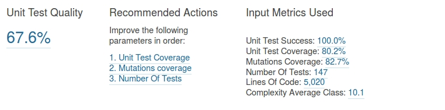

# SonarQube Sedcat Plugin #

Sedcat es un plugin para la plataforma de gestión de calidad [SonarQube](http://www.sonarqube.org/) la cual provee [análisis estático](https://en.wikipedia.org/wiki/Static_program_analysis) del código Java. Este plugin ha sido creado con el objetivo de suplir 
la escasez de métricas en el ámbito de las pruebas unitarias, para ello proporciona dos métricas: 

* Calidad de las pruebas unitarias, en forma de porcentaje.
* Acciones recomendadas para mejorar el porcentaje de calidad obtenido. 

Dichas métricas son obtenidas a partir de operar métricas de entrada procedentes del proyecto sobre el que se ejecuta el análisis mediante sistemas expertos [Xfuzzy](http://www2.imse-cnm.csic.es/Xfuzzy/). Las métricas de entrada utilizadas son:

* Porcentaje de Éxito de los tests unitarios.
* Cobertura de los tests unitarios.
* Cobertura de mutantes, extraída de los reportes generados por la herramienta [Pitest](http://pitest.org/).
* Número de líneas de código no comentadas.
* Número de casos de test unitarios.
* Complejidad media por clase en base a un umbral por defecto, establecido por el usuario. 

# Instalación

La forma de instalación manual comprende los siguientes pasos:

* Descargar archivo zip de sedcat.
* Generar jar utilizando el comando mvn clean install en el directorio donde se encuentra el archivo pom.xml
* Copiar el jar en la carpeta extensions/plugings de la instancia Sonarqube donde se quiera ejecutar Sedcat. 

# Versiones de SonarQube compatibles

sonar.runtimeVersion=5.3
sonar.runtimeVersion=5.4
sonar.runtimeVersion=5.5

# Dependencias

Para obtener la cobertura de mutantes como métrica de entrada es necesario que el usuario tenga configurada la herramienta
Pitest en su proyecto. Una vez generados los reportes por la herramienta Pitest .html, Sedcat los detecta y extrae el valor de cobertura 
por mutantes. En la pantalla de configuración de sedcat se permite personalizar la ruta donde se deben buscar los reportes.

# Carpeta designUML

Contiene el diseño del plugin representado mediante diagramas de clases en lenguaje UML.

# Carpeta xfuzzySystems

Contiene el código xfl utilizado por la herramienta xfuzzy para generar los sistemas expertos.

# Resultados

# Licencia

Copyright © 2016 Sonar Sedcat Plugin.

Licenciado bajo GNU Lesser General Public License, Versión 3.0
